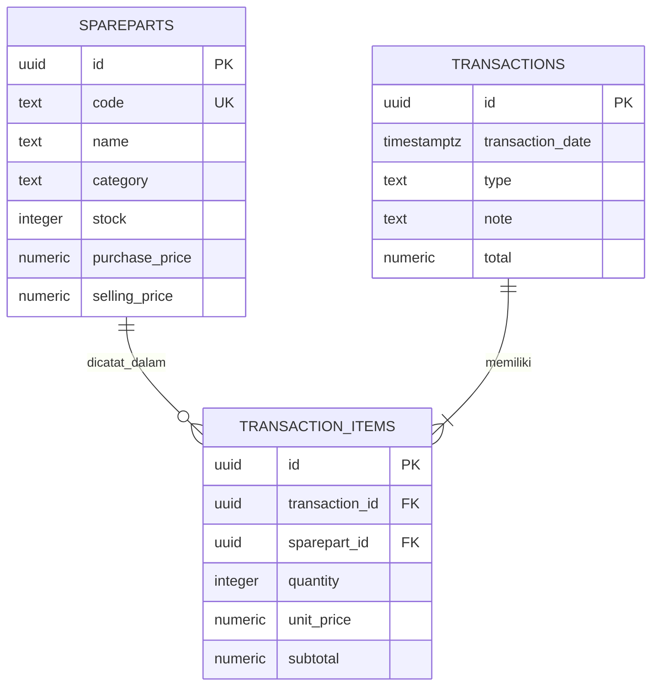

# Sistem Akuntansi Sparepart Motor

Aplikasi inventaris, pembelian, dan penjualan berbasis HTML/CSS/JavaScript dengan Supabase PostgreSQL. Tidak menggunakan login, `package.json`, atau `env.example`.

## Berkas

```text
.
├── app.js
├── index.html
├── public/
│   ├── app.js
│   ├── index.html
│   └── styles.css
└── supabase/
	└── schema.sql
```

## Supabase

1. Buka project Supabase, pilih **SQL Editor**, lalu jalankan seluruh isi `supabase/schema.sql`.
2. Skema membuat tabel `spareparts`, `transactions`, dan `transaction_items`, trigger stok/total, serta policy anonim yang diperlukan aplikasi.
3. Project URL dan publishable key berada di `public/app.js`. Publishable key memang untuk browser; jangan pernah menaruh Secret key atau `service_role` key di repository.

Mode tanpa login memberi pengunjung akses anonim untuk membaca dan mengubah katalog serta mencatat transaksi. Gunakan hanya untuk demo atau data yang memang boleh diakses publik.

## GitHub Pages

Frontend mendeteksi host GitHub Pages dan memanggil Supabase langsung. File `index.html` di root meneruskan halaman Pages repository ke `public/`. Aktifkan Pages dari repository **Settings > Pages**, pilih branch dan folder root, lalu tunggu deployment selesai. Jika project Pages lama masih cached, lakukan hard reload (`Ctrl+F5`).

Jika perubahan katalog atau transaksi ditolak, jalankan kembali SQL terbaru di Supabase SQL Editor agar grant dan RLS sesuai.

## Menjalankan lokal

Membutuhkan Node.js 18 atau lebih baru. Dari folder proyek:

```powershell
node app.js
```

Buka `http://localhost:3000`. Di port ini frontend menggunakan API Node; pada GitHub Pages atau Live Server port `5500`, frontend menggunakan Supabase langsung.

## ERD


