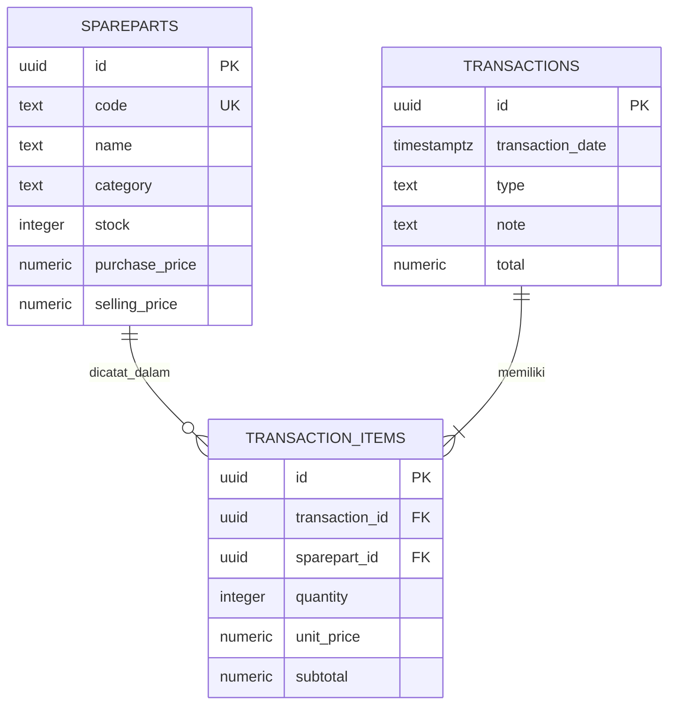

# Sistem Akuntansi Sparepart Motor

Aplikasi pencatatan inventaris, pembelian, dan penjualan dengan frontend HTML/CSS/JavaScript, server Node.js tanpa dependensi tambahan, dan Supabase PostgreSQL.

## Struktur

```text
.
├── app.js
├── public/
│   ├── app.js
│   ├── index.html
│   └── styles.css
└── supabase/
    └── schema.sql
```

## Menyiapkan Supabase

1. Buka project Supabase Anda.
2. Buka **SQL Editor**, lalu jalankan seluruh isi `supabase/schema.sql`.
3. Aplikasi tidak memakai fitur login atau Secret key. Publishable key digunakan dengan akses role `anon`.

Mode tanpa login ini memberi akses anonim untuk membaca data, menambah/mengubah/menghapus katalog, dan mencatat transaksi. Gunakan hanya untuk demo atau lingkungan lokal; siapa pun yang dapat mengakses project dapat mengubah data.

## Menjalankan aplikasi

Membutuhkan Node.js 18 atau lebih baru; tidak diperlukan `package.json` maupun file environment. Aplikasi langsung terbuka tanpa login.

- `SUPABASE_URL`: opsional jika memakai project URL bawaan di `app.js`
- `SUPABASE_PUBLISHABLE_KEY`: opsional jika memakai publishable key bawaan di `app.js`
- `PORT`: port server (opsional, default `3000`)

PowerShell:

```powershell
node app.js
```

Buka `http://localhost:3000`. Jangan gunakan Live Server untuk alur API. Untuk menerapkan perubahan skema atau kebijakan akses, jalankan kembali SQL di Supabase SQL Editor.

## ERD



Stok dan total transaksi diperbarui dengan trigger database. RPC `create_transaction` membuat header dan detail dalam satu operasi database, dengan harga diambil dari katalog dan validasi stok penjualan.
